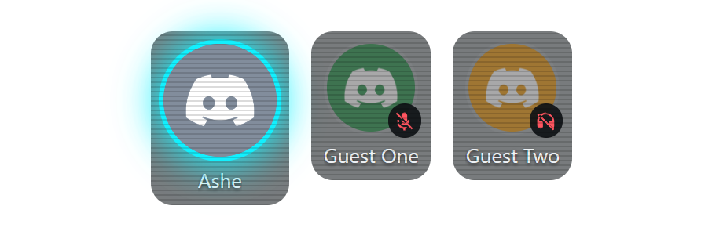

# Greenroom

**VDO.ninja guest dock + Discord voice roster for OBS, driven by Streamer.bot.**

Four swappable guest camera slots that follow your guests by *name* — when
someone's connection drops and they rejoin VDO.ninja with a fresh stream ID,
their slot re-acquires them automatically within ~2.5 s. Plus a standalone
Discord voice-channel overlay (the StreamKit-style roster, rebuilt): avatars
with a speaking glow, **mute/deaf badges**, streamer-first ordering, themeable
with CSS variables. A guest slot can also show a Discord user's avatar instead
of a camera — the "voice-only guest" placeholder that lights up when they talk.
A **guest directory** maps a VDO.ninja label and/or Discord user to an on-stream
display name + social handles, rendered as a **nameplate** (lower-third in the
slot, or a freely positioned standalone source) whenever that guest is live.



Streamer.bot is the entire backend: its WebSocket Server is the message bus, its
HTTP Server serves the pages, and five small pasted C# actions cache + rebroadcast
state. No always-on Node service. The only optional process is the Discord
bridge — a muted-but-listening discord.js bot that feeds real-time
speaking/mute/deaf state — and webcam-only setups never install it.

## How it works

```
control.html / director-min.html (browser — hosts a hidden vdo.ninja director
  iframe; resolves guest label → live streamID every 2.5 s)
        │ DoAction "VDO Push" (full state, pre-serialized)
        ▼
Streamer.bot ─ WS :8080 ── broadcasts vdoninja:update / discord:voice:update ──►
  actions: VDO Push · Discord Voice Push · VDO Sync · Discord Voice Command      │
  globals: vdo.state (persisted) · discord.state (non-persisted)                 │
        ▲ DoAction "Discord Voice Push"     ▲ commands back down the same bus    ▼
sidecar/discord-bridge.mjs (optional discord.js bot,          OBS Browser Sources:
  joins voice muted-but-listening, 100 ms coalesce)           guest slots ×4 + roster
```

Slots bind by VDO.ninja **label** (the stable key); stream IDs are volatile and
re-resolved continuously — that loop *is* the auto-follow feature. State lives in
Streamer.bot's global variables, so the control page can close and everything
still paints (every page replays state via the `VDO Sync` action on connect).

## Quick start

**A — webcam slots only (no Node, no installs):**
1. Follow [docs/STREAMERBOT-SETUP.md](docs/STREAMERBOT-SETUP.md): enable SB's
   WebSocket (:8080, auth off) + HTTP (:7474) servers, map `control` and
   `overlay` to this repo's folders, paste the 4 core actions (skip
   `Discord Bridge Start`).
2. Add OBS Browser Sources:
   `http://127.0.0.1:7474/greenroom-overlay/vdoninja-guest.html?slot=1` (…2, 3, 4).
3. Open `http://127.0.0.1:7474/greenroom-control/control.html`, set your room + password,
   enable the director, and bind slots to guest labels. Keep one director page
   open (a 1×1 source running `director-min.html` is the set-and-forget option).
   The invite builder hands you guest links (`&hash=` password mode included).
4. *(optional)* Add guests to **Nameplates & Guest Directory** for on-stream
   names + socials. The lower-third appears in each slot automatically
   (`?nameplate=0` to hide); for a freely positioned plate add
   `…/greenroom-overlay/nameplate.html?slot=1` as its own source
   (docs/THEMING.md).

**B — add Discord voice (roster overlay + voice-only slots):**
1. `cd sidecar && npm install` (Node ≥ 22.12).
2. Create a bot (non-privileged Guilds + Guild Voice States intents; View
   Channel + Connect on the target channel), paste its token into
   `sidecar/discord-tokens.json` — file-only, never enters the control page.
3. Run `start-discord-bridge.bat` (or the optional `Discord Bridge Start`
   action), add
   `http://127.0.0.1:7474/greenroom-overlay/discord-roster.html?layout=row` as a
   source, pick a channel in the control page and press USE → Connect.
4. *(optional)* Tick **"leave call & quit when Streamer.bot closes"** in the
   control page so the bot hangs up and the sidecar exits when you close SB
   instead of lingering in the call (an SB restart reconnects and stays;
   docs/STREAMERBOT-SETUP.md).

Serve over `http://`, never as an OBS "Local file" — the VDO viewer renders
black in a `file://` parent and `file://` sources ignore URL params.

## Repo layout

```
control/    control.html (director + slot editor + invite builder + Discord section)
            director-min.html (1×1 always-on director) · vdo-parse.js (defensive parser)
overlay/    vdoninja-guest.html (?slot=N) · discord-roster.html (?layout=row|grid)
            nameplate.html (?slot=N standalone nameplate) · nameplate-shared.js
            panel-client-sb.js (SB transport shim)
actions/    the five Streamer.bot C# actions (paste + compile)
sidecar/    discord-bridge.mjs (optional discord.js bot) · its package.json
docs/       STREAMERBOT-SETUP.md · PROTOCOL.md · THEMING.md · screenshots
backup.mjs  snapshot/restore the SB dock config (room/slots/directory) to a file
mock-sb-server.mjs · mock-vdo-director.html · mock-discord-bridge.mjs
verify.mjs · verify-render.mjs · tools/shots.mjs · start-discord-bridge.bat
```

There are deliberately no per-slot HTML stubs: stubs only ever served OBS
"Local file" mode, which can't host the VDO viewer anyway — `?slot=N` covers it.

## Backups

The dock config — room, password, slots, invite, and the **guest directory /
nameplates** — lives only in Streamer.bot's persisted `vdo.state` global. Two ways
to keep a file copy:

- **In the control page:** the header's **Export config** / **Import config**
  buttons. Export downloads a JSON snapshot; Import loads one and re-pushes it to
  SB (so it persists like an edit — it *replaces* the current config).
- **CLI** (SB or `npm start`'s mock must be running):
  ```
  npm run backup                       # → backups/vdo-state-<timestamp>.json
  npm run backup:list
  npm run backup:restore -- <file>     # push a snapshot back into SB
  ```
  `SB_WS_URL` / `SB_WS_PORT` (or `--url`) point it at a non-default SB.

Snapshots contain the **room password**, so `backups/` is gitignored — treat the
files as secret. The Discord bot's favorites/settings are already file-based in
`sidecar/discord-voice-config.json` (copy it to back those up); the live voice
roster is intentionally not snapshotted.

## Verification (no Streamer.bot, Discord, or camera needed)

```
npm install          # root dev deps (ws)
npm run verify       # 81 checks: transport, both push round-trips (incl. the guest
                     # directory), persisted-vs-non-persisted restart semantics, the
                     # command bus, the REAL sidecar token-less over the bus, the
                     # exit-when-Streamer.bot-closes lifecycle (opt-in leave+quit vs
                     # default reconnect-forever), the backup CLI save+restore
                     # round-trip, malformed-guestList parser, HTTP serving +
                     # tripwires (incl. "no token string in control.html" and the
                     # director-min directory strip-guard)
npm install --no-save playwright-core
npm run verify:render  # 32 real-browser checks: guest slot URL assembly + the
                       # auto-follow REJOIN swap driven by a scripted fake director,
                       # nameplates (lower-third + standalone + rotator + hide rules),
                       # PFP glow, roster badges/order/hide + directory name override,
                       # a 20-user 100 ms burst, control page hydrate/edit/USE
npm start            # mock Streamer.bot (:7474/:8080) for hands-on dev
npm run mock:bridge  # token-less fake Discord bridge (drives the roster live)
```

The mocks prove the protocol and the pixels; what only a live session can prove
(real vdo.ninja shapes, real bot voice handshake, SB action-queue latency, the
OBS-dock CEF question) was then exercised on a real Streamer.bot 1.0.4 rig —
including the OBS Custom Browser Dock running the director, a real-room
drop/rejoin auto-follow, and live Discord speaking events. Results and the
remaining open item (multi-director safety) are in
[docs/STREAMERBOT-SETUP.md](docs/STREAMERBOT-SETUP.md#6-live-validation-results-2026-07-10-real-streamerbot-104).

## Security posture

Localhost trust: SB's WS runs with authentication off, and the room password
travels in the broadcast payload because view URLs need it. The Discord bot
token never does — it lives only in the gitignored `sidecar/discord-tokens.json`,
and no bus command can carry one (`verify` enforces that `control.html` doesn't
even contain the string). Don't expose SB's servers beyond localhost.

## Origins

Extracted from a personal streaming toolkit, where this ran as part of a bespoke
ControlPanel + relay-service stack; the port design is documented in that
repo's research notes (the director enumeration moved into the control page, the
bot became this sidecar, and Streamer.bot's WS replaced the relay). The
battle-tested parts — rejoin races, the Discord error taxonomy, the BigInt
default-avatar math, the 100 ms coalesce — carried over unchanged.

## Author & support

Built by **Ashe "Flash" Galatine**.

- Email — [AsheJunius@gmail.com](mailto:AsheJunius@gmail.com)
- X — [@AsheJunius](https://x.com/AsheJunius) · BlueSky — [@projectgalatine.com](https://bsky.app/profile/projectgalatine.com)
- Twitch — [FlashGalatine](https://www.twitch.tv/FlashGalatine) · Discord — [Newbie Fight Club](https://discord.gg/NewbieFightClub)
- Support — Patreon [ProjectGalatine](https://www.patreon.com/ProjectGalatine) · CashApp [$ProjectGalatine](https://cash.app/$ProjectGalatine)

## Credits & license

MIT — see [LICENSE](LICENSE). Root runtime dependency is
[ws](https://github.com/websockets/ws) (MIT). The optional Discord bridge
sidecar depends on [discord.js](https://discord.js.org) +
[@discordjs/voice](https://github.com/discordjs/discord.js/tree/main/packages/voice)
(Apache-2.0) and [libsodium-wrappers](https://github.com/jedisct1/libsodium.js)
(ISC). The guest dock drives [VDO.ninja](https://vdo.ninja) via its public
IFrame API — nothing from VDO.ninja is vendored here. Greenroom is not
affiliated with Streamer.bot, VDO.ninja, or Discord.
