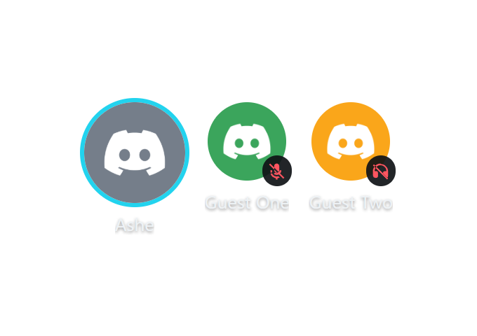

# Theming the Discord roster overlay

`overlay/discord-roster.html` is styled entirely by CSS custom properties in one
`:root {}` block plus a handful of URL params — the same re-skin model as the
other components in this family.

## The 60-second reskin

Open `discord-roster.html`, edit the `:root` block:

| Variable | Default | What it drives |
|---|---|---|
| `--accent` | `34, 211, 238` (cyan) | speaking glow — an `R, G, B` **triplet** (goes into `rgba(var(--accent), α)`) |
| `--avatar-px` | `56px` | guest avatar size |
| `--streamer-px` | `72px` | streamer avatar size |
| `--gap` | `14px` | spacing between members |
| `--name-size` / `--name-color` / `--name-font` | `13px` / near-white / Segoe UI | name labels |
| `--chip-bg` | dark translucent | per-member backing chip |
| `--chip-pad` | `8px` | chip padding |
| `--badge-bg` / `--badge-fg` | dark disc / red | mute+deaf badge disc and glyph |
| `--blink-s` | `.9s` | speaking pulse period |
| `--radius` | `14px` | chip corner radius |

Avatar size, accent, and the streamer id can also be changed **live** from the
control page — they ride the payload's `settings` block, no file edit needed.

## URL params (http-served, so they work in OBS)

Per-source overrides; precedence is **URL param → payload settings → default**:

| Param | Values | Meaning |
|---|---|---|
| `?layout=` | `row` (default) \| `grid` | horizontal strip vs wrapping panel |
| `?labels=` | `1` (default) \| `0` | show/hide username labels |
| `?avatar=` / `?streamerpx=` | px | avatar sizes |
| `?accent=` | `cyan` \| `magenta` \| `neon-green` \| `R,G,B` | glow color |
| `?streamer=` | user id | streamer-first ordering override |
| `?hidewhenabsent=` | `1` \| `0` | hide everything when the streamer isn't in voice |
| `?theme=plain` | — | the second look (below) |
| `?max=` | n | cap rendered members; the rest collapse into a `+N` chip |
| `?sbport=` / `?sbdebug=1` | — | transport knobs (overlay/panel-client-sb.js) |

## The plain theme

`?theme=plain` strips the chips, scanlines, and blink animation down to bare
avatars with a thin solid speaking ring — for layouts where the default look is
too loud:

Effect toggles that ride `settings`: `scanlines` (chip texture) and `neonBlink`
(pulse animation) — both ignored by the plain theme, which is always quiet.

## Badges

Mute (mic-slash) and deafen (headphones-slash) are inline SVGs — no external
assets. Deafen implies mute visually, so a deafened member shows only the deafen
badge (Discord's own convention). Recolor via `--badge-bg`/`--badge-fg`; resize
automatically with the avatar (38% of avatar size, 18px minimum).

## Speaking glow

The glow is the shared visual language across Greenroom: the same treatment
lights the single-avatar discord mode in the guest slots
(`overlay/vdoninja-guest.html`, hardcoded neon-green there) and the roster
members (accent-colored here). Idle members sit at reduced
opacity/brightness; speaking members brighten and gain the ring + bloom.
